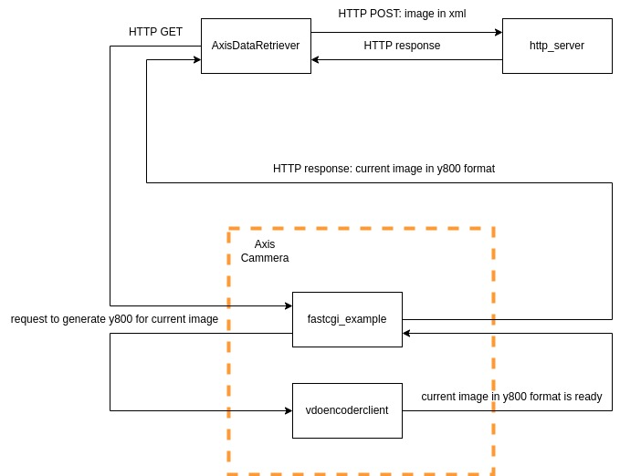

## General
The application is developed to retrieve the current image from the Axis device and transfer it to the HTTP server.
To retrieve the data from the Axis device the [Native SDK](https://axiscommunications.github.io/acap-documentation/docs/api/native-sdk-api.html) is used.

Also, the following application are uploaded to the Axis device:

* [VDO Client](https://github.com/AxisCommunications/acap-native-sdk-examples/tree/main/vdostream)
* [Fast CGI](https://github.com/AxisCommunications/acap-native-sdk-examples/tree/main/web-server-using-fastcgi)



## Prerequisites
Upload `fastcgi_example_1_0_0_armv7hf.eap` and `vdoencodeclient_1_0_0_armv7hf.eap` to Axis device.

Run `fastcgi_example_1_0_0_armv7hf` on Axis device

Set `IP address`, `user` and `password` in `config/configs.xml` file.

Run http server
```
python2 http_server/http-server.py 8080
```

## Build application
```
cmake -B build
cmake --build build
```

## Run application
Do not forget to set `IP address`, `user` and `password` in `config/configs.xml` file

```
build/AxisDataRetriever config/configs.xml
```
